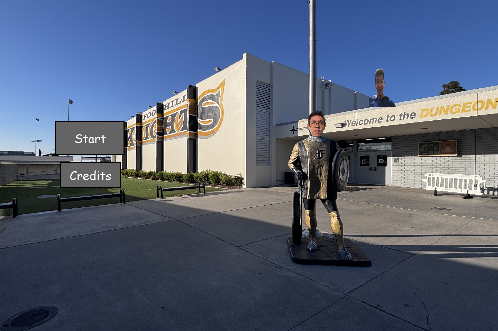
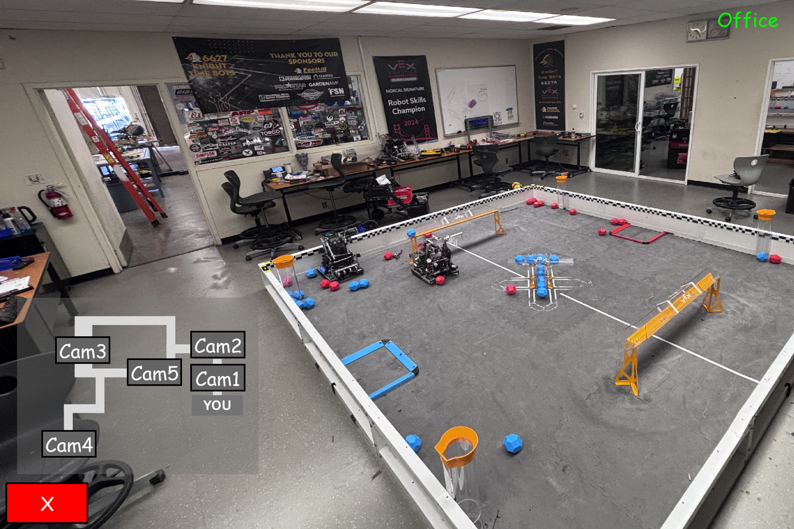

# Five Knights at Trenstein's

A Five Nights at Freddy's and Five Nights at Epsteins inspired survival game built with Python and Pygame.

Survive the night while the Knights roam through security cameras searching for your office.

---

## Features

- Multiple camera rooms
- Enemy movement using threads
- Mouse-based camera panning
- Sound effects and ambient static
- Fullscreen gameplay
- Custom UI system
- Cheesy jumpscare mechanics

---

## Installation

Clone the repository:

```bash
git clone https://github.com/YOUR_USERNAME/Five-Knights-at-Trensteins.git
cd Five-Knights-at-Trensteins
```

Install dependencies:

```bash
pip install -r requirements.txt
```

or:

```bash
pip install pygame
```

---

## Running the Game

Run:

```bash
python main.py
```

---

## Controls

| Control | Action |
|---|---|
| Mouse | Move camera |
| Left Click | Press buttons |
| ESC | Quit game |

---

## Requirements

- Python 3.11+
- Pygame 2.5+

---

## Project Structure

```
assets/
    images/
    camera.mp3
    static.ogg

data_types.py
game.py
knight.py
main.py
```

---

## Screenshots

## Main Menu



## Camera System



---

## Credits

- Mason Rustad — Programming & Game Design & Enemy
- Trenton — Photography & Trenstein lore & Enemy
- Ethan Rustad — Enemy

---

## Inspiration

- Five Nights at Freddy's
- Classic point-and-click survival horror games

---

## License

MIT License
